# DRAMS Live — Complete System Documentation

> **Application:** DRAMS Live (CTD telecom-data & person-intelligence analysis platform)
> **Framework:** Kohana 3.x PHP HMVC (MVC + ORM)
> **Base URL (production):** `https://ctd.drams.com`
> **Document type:** Architecture, data model, and end-to-end process flowcharts
> **Generated:** 2026-06-08

> **How to read the diagrams:** All diagrams below are written in **Mermaid**. They render automatically on GitHub, in VS Code (with the *Markdown Preview Mermaid* extension), in JetBrains IDEs, and in the accompanying `DRAMS_Live_System_Documentation.html` file (open in any browser — no internet required). A Word version with the diagrams embedded as images is provided as `DRAMS_Live_System_Documentation.docx`.

---

## Table of Contents

1. [Executive Overview](#1-executive-overview)
2. [Technology Stack](#2-technology-stack)
3. [High-Level System Architecture](#3-high-level-system-architecture)
4. [Request Lifecycle (HMVC Flow)](#4-request-lifecycle-hmvc-flow)
5. [Codebase / Module Structure](#5-codebase--module-structure)
6. [Controller Catalogue](#6-controller-catalogue)
7. [Data Model (Entity-Relationship)](#7-data-model-entity-relationship)
8. [Database Connections (Federated Data Sources)](#8-database-connections-federated-data-sources)
9. [Authentication, Sessions & RBAC](#9-authentication-sessions--rbac)
10. [Core Process Flowcharts](#10-core-process-flowcharts)
    - 10.1 [Login & Session](#101-login--session-flow)
    - 10.2 [Person Search → Profile](#102-person-search--profile-flow)
    - 10.3 [Telecom Data Request Lifecycle ⭐](#103-telecom-data-request-lifecycle-the-core-flow)
    - 10.4 [CDR / Bulk Data Ingestion](#104-cdr--bulk-data-ingestion-flow)
    - 10.5 [Identity Sync — NADRA / Verisys / Family Tree / Travel](#105-identity-sync--nadra--verisys--family-tree--travel-history)
    - 10.6 [Watchlist Management](#106-watchlist-management-flow)
    - 10.7 [Reporting & Audit](#107-reporting--audit-flow)
    - 10.8 [Cron / Background Processing Pipeline](#108-cron--background-processing-pipeline)
    - 10.9 [External Integrations](#109-external-integrations-aiescctw-gmail-ocr)
11. [Sitemap & Navigation](#11-sitemap--navigation)
12. [User Roles & Journeys](#12-user-roles--journeys)
13. [Appendix A — Database Table Inventory](#appendix-a--database-table-inventory)
14. [Appendix B — Glossary](#appendix-b--glossary)

---

## 1. Executive Overview

**DRAMS Live** is a web-based intelligence and investigation platform used to collect, enrich, analyse and report on **persons of interest** and their **telecommunications activity**. It is built for a law-enforcement / counter-terrorism workflow and centres on five capabilities:

| # | Capability | What it does |
|---|------------|--------------|
| 1 | **Person profiling** | A 360° record per person: identity (CNIC/NADRA, foreigner, passport), addresses, education, banks, criminal record, affiliations, training, relations, devices, SIMs, photos. |
| 2 | **Telecom data acquisition** | Submits formal data requests (CDR, subscriber info, current location, etc.) to mobile operators **via email**, then automatically parses the operators' email replies back into the database. |
| 3 | **CDR analysis** | Call/SMS detail-record analytics — call & SMS summaries, B-party (who they talk to) analysis, location/cell-tower tracking, device/IMEI/SIM history, graph visualisations. |
| 4 | **External data federation** | Searches across several external government / telecom databases (subscriber DB, ECP, KPK-CTD, DLMS driving licenses, government-employee DB) plus identity services (NADRA, Verisys, Family Tree, Travel History) and an AIES/CCTW REST API. |
| 5 | **Watchlists, reporting & audit** | Tag and watch persons, build user/person/admin analytics, and keep a full audit trail of every analyst action. |

The system is **role-based**: each user only sees the menus and data their role permits, and every search/view/request is logged.

---

## 2. Technology Stack

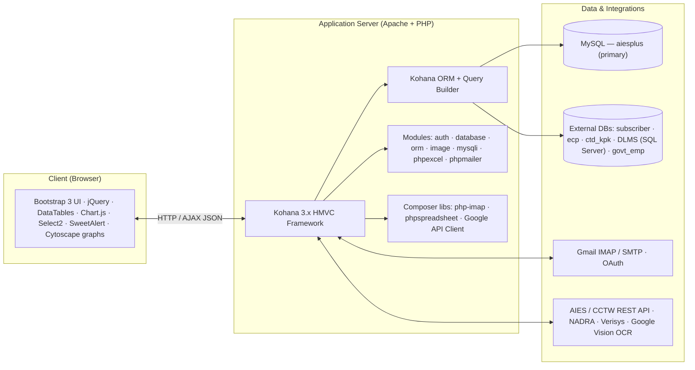

| Layer | Technology |
|-------|------------|
| Language / Runtime | PHP 5.x+ on Apache (XAMPP in dev) |
| Framework | Kohana 3.x (HMVC) — `system/`, framework modules in `modules/` |
| ORM / DB access | Kohana ORM, Query Builder, `mysqli` driver |
| Auth | Kohana `auth` module, ORM driver, SHA256 password hashing |
| Mail | PHPMailer (send) + PHP IMAP / `webklex/php-imap` (receive), Gmail OAuth |
| Spreadsheets | `phpoffice/phpspreadsheet` + legacy `phpexcel` module (Excel exports / bulk upload parsing) |
| Frontend | Bootstrap 3.3, jQuery, DataTables, Chart.js, Select2, jQuery-Confirm, SweetAlert, Cytoscape (CDR graphs) |
| Primary DB | MySQL — `aiesplus` (prod) / `aiesdev` (dev) |
| Federated DBs | `subscriber_db`, `ecp`, `ctd_kpk`, `DLMS_FamzSolutions` (MS SQL Server), `govt_emp_data` |

---

## 3. High-Level System Architecture

The application follows Kohana's **HMVC** pattern with a strict layered design. A single base controller (`Controller_Working`) enforces authentication and RBAC for every authenticated page; a few public controllers (login, cron, REST API) bypass it deliberately.

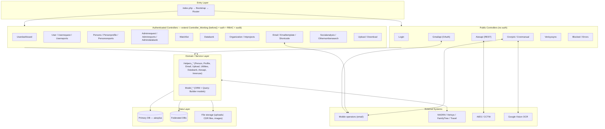

**Controller inheritance**

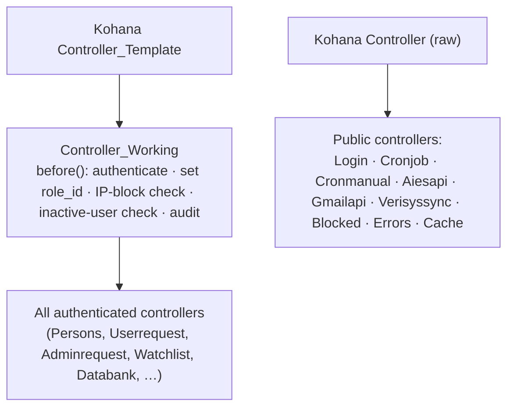

---

## 4. Request Lifecycle (HMVC Flow)

Every browser hit follows the same pipeline. `Route::set('default', '(<controller>(/<action>(/<id>)…))')` maps URLs to controller/action; the default controller is `login`.

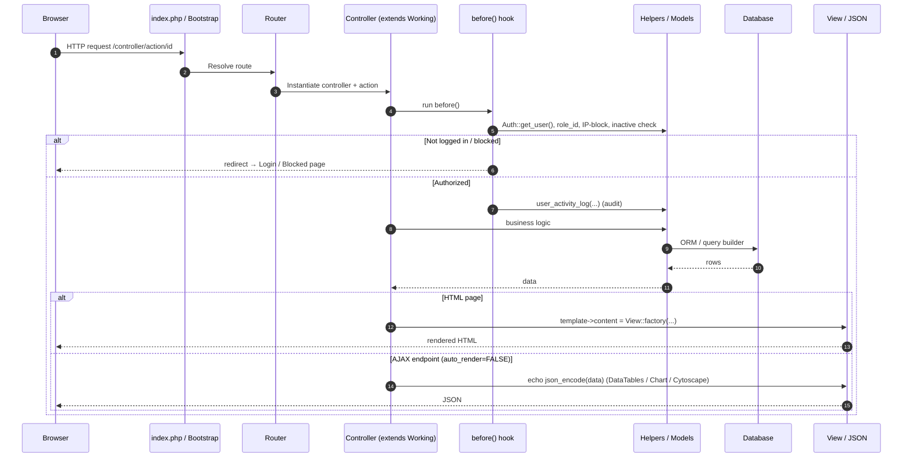

**Two response styles**

- **Full pages** — render through the Kohana template wrapper (`site-header`, `sidebar_user`/`sidebar_person`, `site-footer`). View bodies often live in `*_functions/*.inc` includes.
- **AJAX endpoints** — set `auto_render = FALSE` and `echo json_encode(...)`. Most list/table data uses the **DataTables** server-side shape `{sEcho, iTotalRecords, iTotalDisplayRecords, aaData}`; charts use Chart.js arrays; the CDR network graph uses **Cytoscape** node/edge JSON.

---

## 5. Codebase / Module Structure

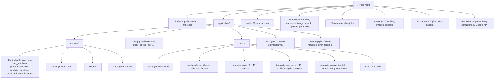

**Include-file convention.** Large controllers keep each action's view-binding logic in a matching `.inc` include:
`Controller/user_functions/*.inc` (User), `Controller/persons_functions/*.inc` (Persons), `Controller/watchlist_functions/*.inc` (Watchlist), `Controller/excel/*.inc` (Excel report exports), and `Controller/cron_job/<task>/*.inc` (per-operator send/parse logic).

---

## 6. Controller Catalogue

| Controller | Auth | Purpose | Key Models / Helpers |
|------------|:----:|---------|----------------------|
| **Login** | ✗ | Username/password + IP-throttled login, one-time token login (remote workspace), password recovery | `Model_Generic`, `ORM User` |
| **Userdashboard** | ✓ | Landing dashboard, person counts (black/grey/white), CNIC/password gating, comparison charts | `Model_Userdashboard`, `Helpers_Profile/Person` |
| **User** | ✓ | Person/identity search, bulk search, data-upload handlers, audit utilities | `Helpers_*`, session caching |
| **Userrequest** | ✓ | User-submitted telco data requests (CDR, subscriber, location, NADRA, family-tree, travel, blocked numbers), scheduling, parsing queue, analytics (~60 actions) | `Helpers_Upload/Email`, `Model_Email` |
| **Userreports** | ✓ | User-activity analytics: logins, requests sent, panel/URL logs, audit & performance reports | `Model_Userreport` |
| **Persons** | ✓ | CDR analytics dashboard: call/SMS summaries & detail, B-party, location/cell logs, CDR graph, NADRA profile, family tree (~70 actions) | `Helpers_Person`, `Model_Persons` |
| **Personprofile** | ✓ | Edit the 360° person record: basic info, mobiles, relations, identities, education, banks, criminal records, affiliations, trainings; Verisys/FamilyTree/Travel updates | `Helpers_Person/Profile`, `Model_Personprofile` |
| **Personsreports** | ✓ | Person analytics: lists by category/district, devices/SIMs, top-searched, sensitive list, breakups | `Model_Personsreports` |
| **Adminrequest** | ✓ | Admin/"DRAMS Plus" requests + bulk CSV/Excel upload, autocomplete, status management | `Model_AdminRequest`, `Model_ErrorLog` |
| **Adminreports** | ✓ | System reports: identity breakups, Verisys pending/response, user breakup, blocked-IP list, **menu management**, password reset | `Model_Adminreports` |
| **Admindatabank** | ✓ | NADRA / MSISDN databank request management & breakup reports (databank role) | DB queries |
| **Organization** | ✓ | Banned-organization registry (view/edit by role) | `Model_Organization` |
| **Intprojects** | ✓ | Internal projects / investigations registry | `Model_Organization` |
| **Watchlist** | ✓ | Tag persons, add/remove from watchlist, area-wise & user watchlists | `Model_Watchlist` |
| **Databank** | ✓ | Federated advanced search: subscriber, ECP (+family), KPK-CTD, DLMS, govt-employee | `Helpers_Databank` |
| **Email** | ✓ | Build & send telco request emails; NADRA/Verisys/FamilyTree/Travel/banking requests; receive handlers | `Helpers_Email`, `Model_Email` |
| **Emailtemplate / Shortcode** | ✓ | CRUD for email templates and telco short-codes | `Model_Emailtemplate` |
| **Socialanalysis** | ✓ | Manage a person's social-media & portal links (add/edit/approve) | `Model_Socialanalysis` |
| **Othernumbersearch** | ✓ | Find other/affiliate numbers linked to a person; bulk in-depth search | `Model_Othernumber` |
| **Upload / Download** | ✓ | File upload (CDR/IMEI/doc), MSISDN/CNIC validation lookups; access-controlled downloads | `Helpers_Upload`, `Model_Generic` |
| **Cronjob** | ✗ | Background email **send** (by operator/priority) and email **parse** (subscriber/location/NIC/phone-CDR/IMEI), B-party table build, queue retries, OCR daemon, DB health (~30 actions) | `Helpers_Email`, parse includes |
| **Cronmanual** | ✗ | On-demand manual parsing / log processing / flag updates | — |
| **Aiesapi** | ✗ | REST API for the AIES/CCTW counter-terrorism system: person lookup, 3D module, fingerprints, user/permission provisioning | `Model_Aiesapi` |
| **Gmailapi** | ✗ | Gmail OAuth authorize/callback, send/read email via Google API | Google API Client |
| **Verisyssync** | ✗ | Sync temp-uploaded Verisys / FamilyTree / Travel images into person records | DB queries |
| **Blocked / Errors / Error / ErrorLog / Cache** | mixed | Block page, error pages, error-log viewer, cache endpoints | `Model_ErrorLog` |

---

## 7. Data Model (Entity-Relationship)

The domain centres on the **person**. `person_initiate` is the identity entry point (CNIC / foreigner-ID), `person` is the main record, and a constellation of attribute and activity tables hang off it. Users, roles, requests and lookup tables surround the core.

```mermaid
erDiagram
    person_initiate ||--|| person : "is"
    person ||--o{ person_phone_number : "has SIMs"
    person ||--o{ person_phone_device : "has devices"
    person ||--o{ person_call_log : "calls"
    person ||--o{ person_sms_log : "SMS"
    person ||--o{ person_summary : "contact aggregates"
    person ||--o{ person_location_history : "cell/location"
    person ||--o| person_nadra_profile : "NADRA identity"
    person ||--o| person_foreigner_profile : "foreigner identity"
    person ||--o| person_detail_info : "extra attributes"
    person ||--o{ person_identities : "other IDs"
    person ||--o{ person_education : "education"
    person ||--o{ person_banks : "bank accounts"
    person ||--o{ person_criminal_record : "FIRs"
    person ||--o{ person_affiliations : "org links"
    person ||--o{ person_trainings : "trainings"
    person ||--o{ person_relations : "relations"
    person ||--o{ person_social_links : "social media"
    person ||--o{ person_tags : "tags/watchlist"
    person ||--o{ person_category : "category"
    person ||--o{ person_linked_projects : "projects"

    banned_organizations ||--o{ person_affiliations : "affiliated with"
    lu_tags ||--o{ person_tags : "tag def"
    social_websites ||--o{ person_social_links : "platform"
    district ||--o{ person : "located in"

    users ||--|| users_profile : "profile"
    users ||--o{ user_tokens : "sessions"
    users ||--o{ roles_users : "roles"
    roles ||--o{ roles_users : "members"
    users ||--o{ user_request : "submits"
    users ||--o{ admin_request : "submits"
    users ||--o{ person_linked_projects : "creates"

    user_request ||--o| email_messages : "tracked by"
    user_request }o--|| email_templates_type : "request type"
    user_request }o--o| person : "concerns"
    admin_request ||--o{ admin_nadra_request : "nadra"
    admin_request ||--o{ admin_familytree_request : "familytree"
    admin_request ||--o{ admin_travel_request : "travel"
    person_phone_device ||--o{ person_device_numbers : "SIM-device map"
```

**Core entity descriptions**

| Entity | Role |
|--------|------|
| `person_initiate` | Identity root — `cnic_number` / `cnic_number_foreigner`, fingerprint flag |
| `person` | Main person record — name, father, address, region/district/police-station |
| `person_phone_number` | SIM ↔ person link (owner/user, IMSI, MNC, activation/last-use) |
| `person_phone_device` / `person_device_numbers` | Devices (IMEI) and SIM↔device history |
| `person_call_log` / `person_sms_log` | Raw CDR — A-party, B-party, timestamp, duration, direction, cell/location |
| `person_summary` | Pre-aggregated contact counts (calls/SMS made/received per B-party) |
| `person_nadra_profile` / `person_foreigner_profile` / `person_detail_info` | Identity & demographic enrichment |
| `person_*` attribute tables | education, banks, criminal_record, affiliations, trainings, identities, relations, social_links |
| `person_tags` + `lu_tags` | Tagging & watchlist membership (per district, per user) |
| `user_request` / `admin_request` (+ nadra/familytree/travel) | The data-acquisition workflow records |
| `email_messages` / `admin_email_messages` | Outbound/inbound email audit, linked to requests by `message_id` |
| `email_templates` (+ `email_templates_type`) | Per-operator request body templates |
| `users` / `users_profile` / `roles` / `roles_users` / `user_tokens` | Identity & access |
| `banned_organizations` | Org registry referenced by affiliations |
| `manu_management` | Per-role menu access matrix (RBAC) |
| `files` | Uploaded file tracking (CDR/docs) |
| `inner_token` | Stored API credentials/keys |

---

## 8. Database Connections (Federated Data Sources)

`application/config/database.php` defines **six** connections. The primary (`default`) holds all DRAMS data; the others are read-only federated sources searched from the **Databank** module.

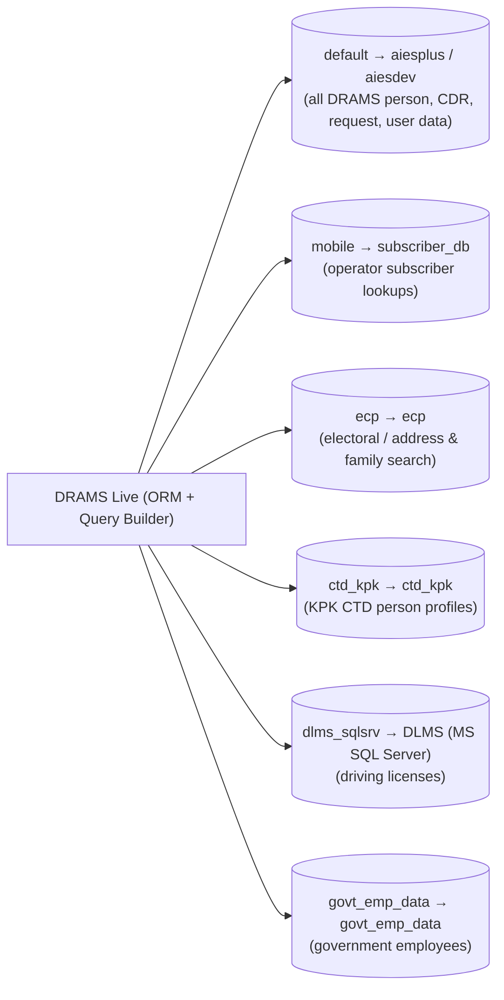

> Connection type is `mysqli` (UTF-8) for MySQL sources and `sqlsrv`/PDO for the DLMS SQL Server source. Credentials live in config (not reproduced here). The `Databank` controller gates access to these via dedicated roles.

---

## 9. Authentication, Sessions & RBAC

**Driver:** Kohana `auth` module, **ORM** driver (`Auth_Orm`). Passwords are **SHA256**-hashed. The session stores only the `user_id` (key `auth_user`); the full `Model_User` ORM object is rehydrated per request. Token lifetime is up to 14 days.

**Three login paths** (all through `Controller_Login`):

1. **Username/password** — `action_check()` with per-IP brute-force throttling (≈5 attempts → IP block).
2. **One-time token** — remote-workspace SSO; URL token is validated for expiry, consumed once, then `Auth::force_login()`.
3. **Password recovery** — `action_forget()` email flow.

**Enforcement** happens in `Controller_Working::before()` on *every* authenticated page:

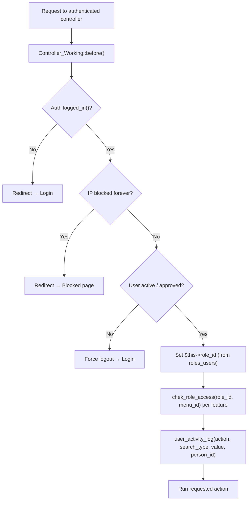

**RBAC model.** Access is decided two ways, combined:

- **Permission level** — `Helpers_Utilities::get_user_permission(user_id)` returns a 0–5 tier (Administrator → Field Officer → Dev support).
- **Data scope** — `get_user_permission_for_requests(user_id)` returns `all | region | district | own`, which filters every request/report query.
- **Menu access** — `chek_role_access(role_id, menu_id)` reads the `manu_management` matrix to show/hide each sidebar item.

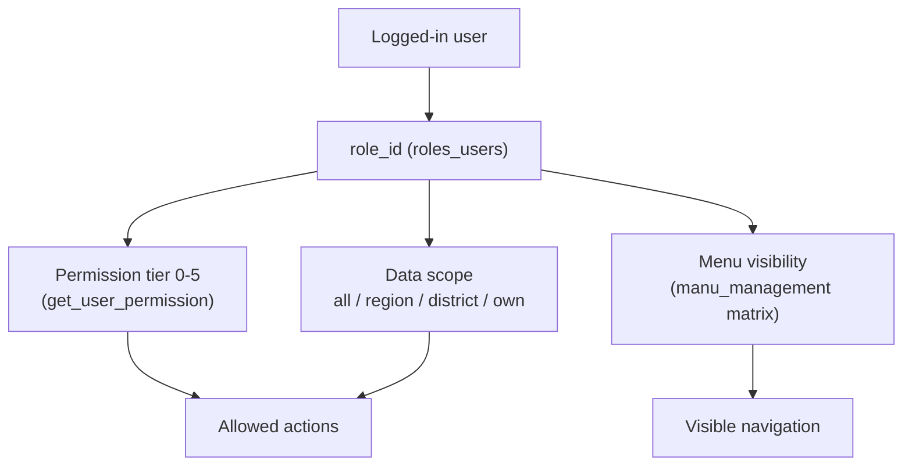

| Tier | Example roles | Capability |
|------|---------------|------------|
| 1 — Administrator | role 1 | Full access; user registration; menu management; ACL |
| 2 — Technical support | roles 2, 4, 6 (HQ/Regional/District) | Search, analysis, reports within scope |
| 3 — Executives | roles 3, 5, 7 | Officer-level review within scope |
| 4 — Field officer | role 8 | Limited / own scope |
| 5 — Dev support | role 9 | Maintenance, menu/user admin |

> Additional fine-grained roles (e.g., Watchlist add = 25, Organization view/edit = 31/32, Databank = 34/35) gate individual modules. Sensitive persons are further protected by `cis_sensitive_person_acl`.

---

## 10. Core Process Flowcharts

### 10.1 Login & Session Flow

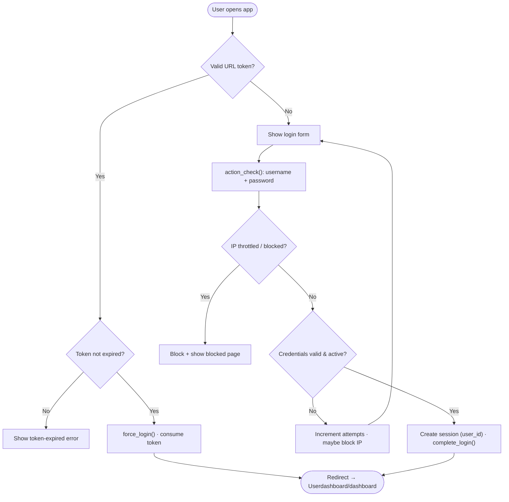

### 10.2 Person Search → Profile Flow

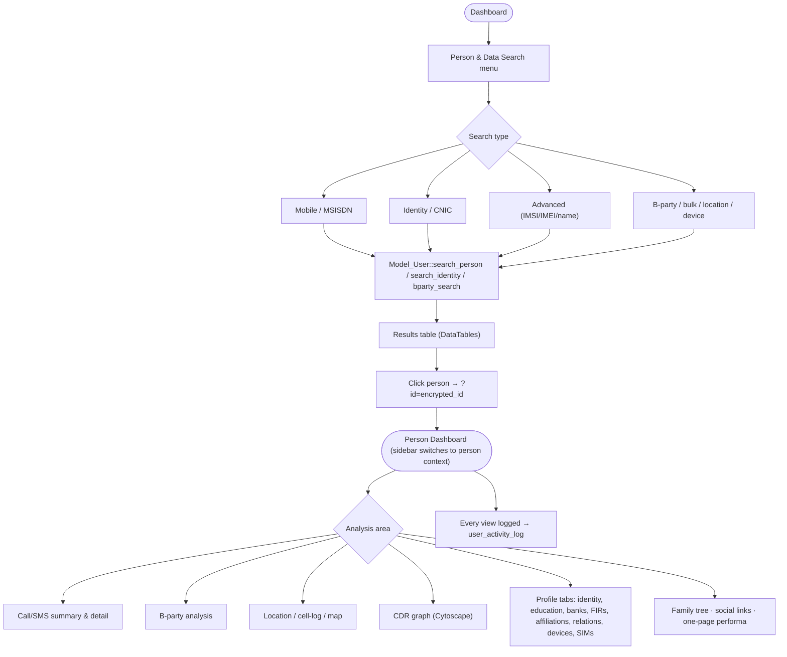

### 10.3 Telecom Data Request Lifecycle (THE CORE FLOW)

This is the heart of DRAMS: a request is created, queued, **emailed to the operator**, the operator **emails a reply**, and a cron parser writes the data back to the person record. It is fully asynchronous and email-driven.

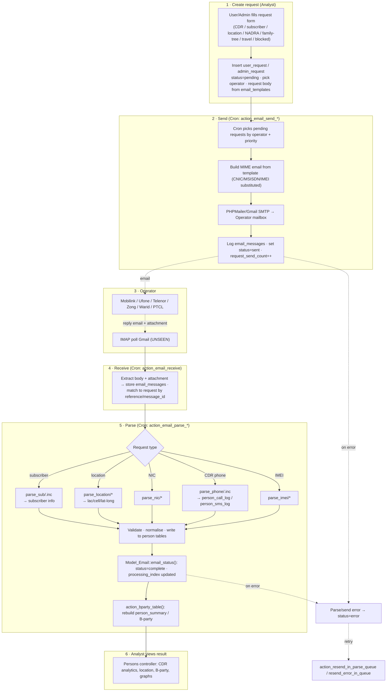

**Status & processing codes** (observed):

| Field | Value | Meaning |
|-------|-------|---------|
| `status` | 0 | pending |
| `status` | 1 | processed / sent |
| `status` | 2 | processing / complete-pending |
| `status` | 3 | error |
| `processing_index` | 3 | error |
| `processing_index` | 4 | received |
| `processing_index` | 5 | not found |
| `processing_index` | 7 | uploaded |
| `processing_index` | 8 | no data |

> Operators are addressed by company case in the parser switch (e.g., Mobilink/Warid, Ufone, Telenor, Zong, PTCL). Request types are keyed by `user_request_type_id` (1/6 = CDR, 3 = subscriber, 4 = location, 5 = NIC, 8 = Verisys, 10 = family tree, 11 = travel).

### 10.4 CDR / Bulk Data Ingestion Flow

When CDR data is supplied as a **file** (not by email), analysts upload it directly.

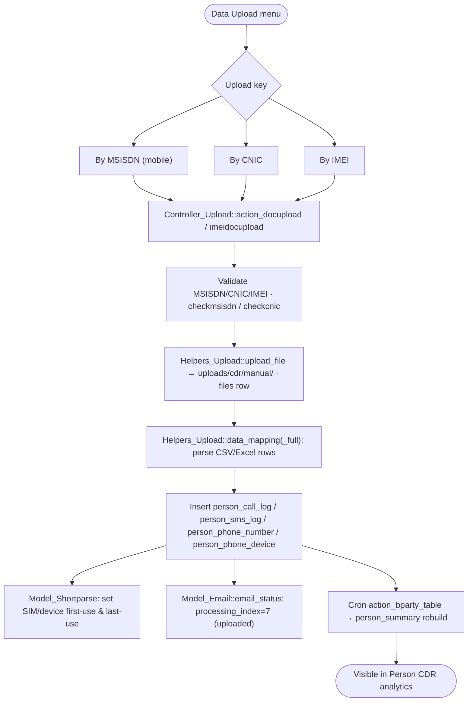

### 10.5 Identity Sync — NADRA / Verisys / Family Tree / Travel History

Identity-document requests follow a two-step pattern: the request goes out (email/API), images/data are dropped into a **temp staging area**, and `Verisyssync` matches them by CNIC into the person record.

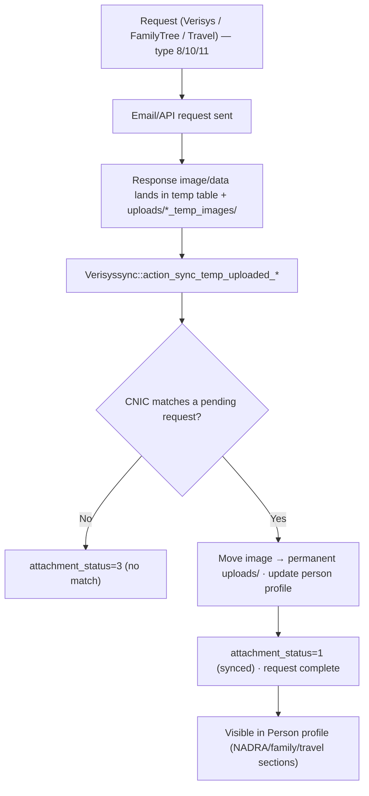

### 10.6 Watchlist Management Flow

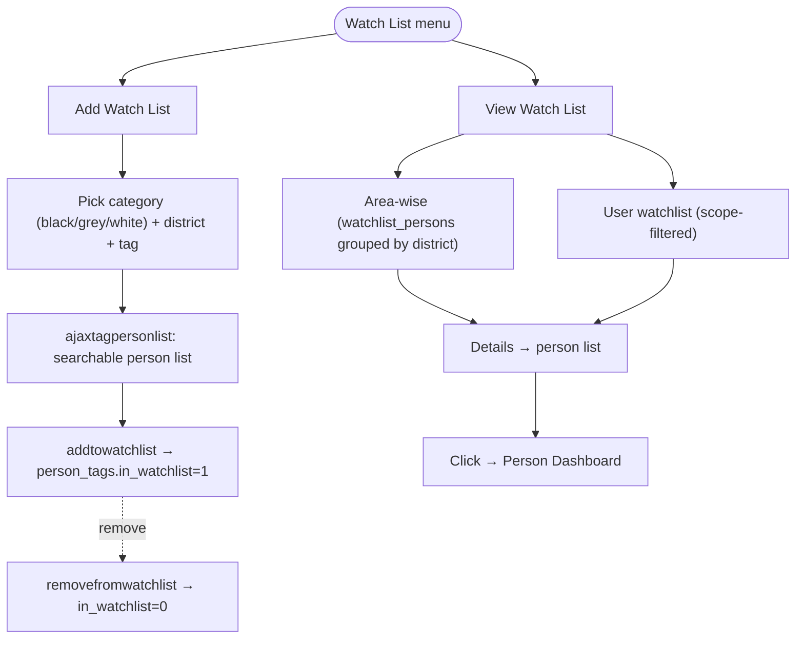

### 10.7 Reporting & Audit Flow

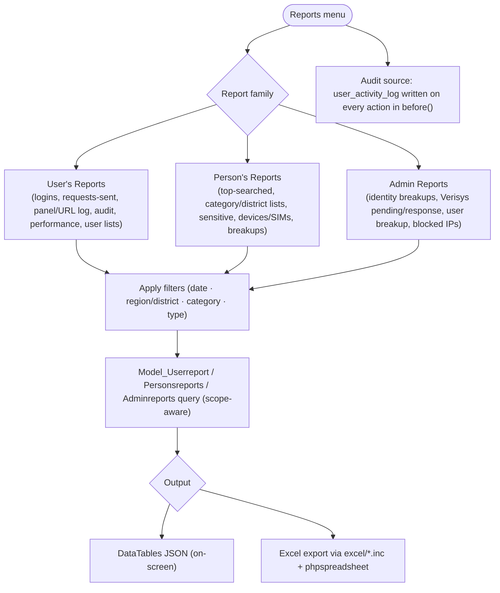

### 10.8 Cron / Background Processing Pipeline

The `Cronjob` controller is the asynchronous engine. Scheduled HTTP hits (or CLI) trigger send/parse/maintenance actions. Locks/cooldowns prevent overlapping IMAP runs.

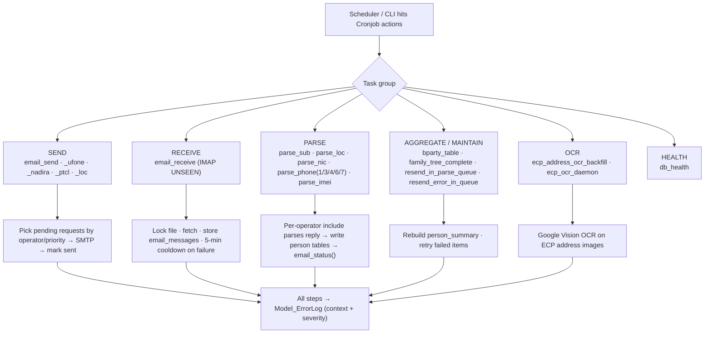

### 10.9 External Integrations (AIES/CCTW, Gmail, OCR)

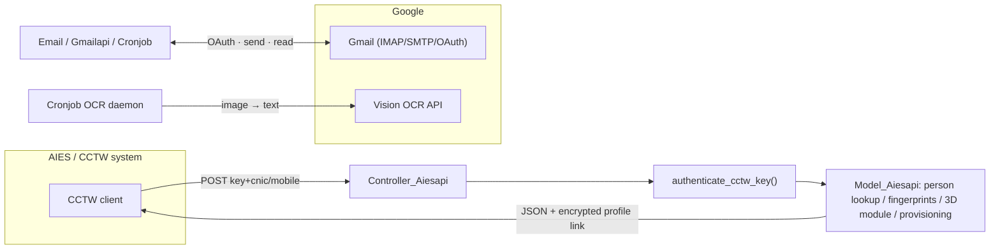

---

## 11. Sitemap & Navigation

The left sidebar (`templates/layout/sidebar_user.php`) is role-filtered; once a person is opened, it swaps to a person-context sidebar (`sidebar_person.php`).

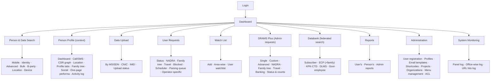

---

## 12. User Roles & Journeys

| User type | Typical roles | Primary journeys |
|-----------|---------------|------------------|
| **Super Admin** | 1 | User registration, menu management, ACL, all reports & DRAMS Plus |
| **Dev / Tech support** | 9 (+2,4,6) | Maintenance, user admin, system logs |
| **Analyst / Operator** | 2–8 | Search persons, analyse CDR, submit requests, build reports |
| **Request manager** | 14+ | Manage request queue, scheduling, projects |
| **Data-upload operator** | 9–12 | Bulk-upload CDR files, monitor parsing |
| **Watchlist user** | 25–26 | Tag & monitor persons |
| **Databank user** | 34/35 (or specific IDs) | Federated identity/address searches |
| **Monitoring** | 57–58 | Panel & URL audit logs |

**Representative end-to-end journey (analyst):**

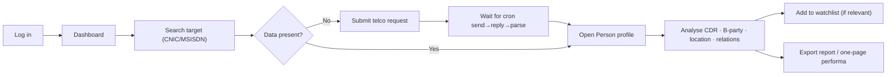

---

## Appendix A — Database Table Inventory

**Person core & activity**
`person_initiate`, `person`, `person_detail_info`, `person_nadra_profile`, `person_foreigner_profile`, `person_phone_number`, `person_phone_device`, `person_device_numbers`, `person_call_log`, `person_sms_log`, `person_summary`, `person_location_history`, `person_category`, `person_category_history`.

**Person attributes**
`person_identities`, `person_education`, `person_banks`, `person_criminal_record`, `person_affiliations`, `person_trainings`, `person_relations`, `person_social_links`, `person_tags`, `person_linked_projects`.

**Requests & email**
`user_request`, `admin_request`, `admin_nadra_request`, `admin_familytree_request`, `admin_travel_request`, `email_messages`, `admin_email_messages`, `email_templates`, `email_templates_type`, `files`.

**Identity / access**
`users`, `users_profile`, `roles`, `roles_users`, `user_tokens`, `manu_management`, `cis_sensitive_person_acl`, `inner_token`.

**Lookups / geography**
`banned_organizations`, `lu_tags`, `social_websites`, `telco_short_code`, `district`, `region`, `police_station`.

> Table and column names are inferred from model/query-builder code; treat as authoritative for documentation but verify against the live schema before migrations.

---

## Appendix B — Glossary

| Term | Meaning |
|------|---------|
| **DRAMS** | The platform name (CTD person-intelligence & telecom-data analysis system) |
| **DRAMS Plus** | Admin-tier advanced/bulk request module |
| **CDR** | Call Detail Record — call/SMS metadata supplied by operators |
| **B-party** | The other party a target communicates with (called/calling number) |
| **MSISDN** | Mobile phone number |
| **IMSI / IMEI** | SIM identity / device identity |
| **CNIC** | Pakistani national ID number (13 digits) |
| **NADRA** | National identity database (identity profile source) |
| **Verisys** | Biometric/identity verification service |
| **ECP** | Electoral database (address/family search) |
| **DLMS** | Driving-license management system (MS SQL Server source) |
| **KPK-CTD** | Khyber Pakhtunkhwa CTD person database |
| **AIES / CCTW** | External counter-terrorism system integrating via REST API |
| **HMVC** | Hierarchical Model-View-Controller (Kohana's request pattern) |
| **manu_management** | Per-role menu-access matrix table (RBAC) |

---

*End of document.*
